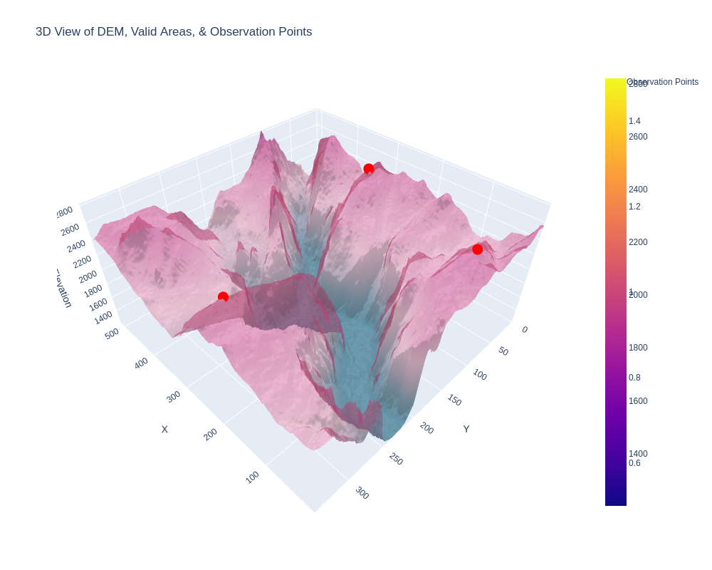

# Spatial Optimizer for Line of Sight Operations

This repository contains a Python implementation of a spatial optimizer designed to place observation towers for applications like cell coverage, surveillance (e.g., wildfire smoke detection), and more. The optimizer uses a simulated terrain by default (capable of using Digital Elevation Models), visibility analysis (adjustable based on needs), and evolutionary algorithms to determine optimal observation points. Valid area masks (or cost surfaces) are supported.

## Table of Contents

- [Overview](#overview)
- [Features](#features)
- [Installation](#installation)
- [Usage](#usage)
  - [Generating Test Surface](#generating-test-surface)
  - [Running the Optimizer](#running-the-optimizer)
- [Visualization](#visualization)
- [Examples](#examples)
- [License](#license)

## Overview

The spatial optimizer solves the problem of determining the best observation point placements on a terrain surface. The primary objective in this implementation is to maximize visible area while avoiding invalid regions (like lakes or steep cliffs). The optimization leverages differential evolution, ray tracing, and polygonal visibility analysis to calculate line of sight.

## Features

- **Surface Generation:** Creates a synthetic 2D surface that mimics real-world terrain with features like hills, valleys, cliffs, and lakes.
- **Visibility Analysis:** Computes the line of sight from any observation point using ray-tracing techniques.
- **Differential Evolution:** Uses evolutionary algorithms to optimize observation point placement.
- **3D Visualization:** Visualizes the surface, observation points, and coverage areas in 3D.

## Installation

1. Clone the repository:
    ```bash
    git clone https://github.com/Skyehawk/spatial_optimizer.git
    cd spatial_optimizer
    ```

2. Install the required dependencies:
    ```bash
    pip install -r requirements.txt
    ```

    Required packages include:
    - `geopandas`
    - `matplotlib`
    - `numpy`
    - `scipy`
    - `shapely`

## Usage

The Spatial_optimizer.py script contains the necessary finction calls to execute out-of-the-box. However, I will highlight a few key areas within the code here (the major finction calls) if you chose to import instead of running standalone.

### Generating Test Surface

You can generate a synthetic surface using the `generate_surface` function. This surface mimics real-world terrain and includes both valid and invalid areas (e.g., cliffs, lakes).

```python
from spatial_optimizer import generate_surface

surface, valid_mask, xx, yy = generate_surface(map_size=100)
```

### Running the Optimizer

To optimize the placement of observation points, run the following:

```python
from spatial_optimizer import objective
from scipy.optimize import differential_evolution

bounds = [(0, 99), (0, 99)] * num_points_to_optimize  # Define bounds for optimization

result = differential_evolution(
    func=objective,
    bounds=bounds,
    args=(surface, valid_mask, fixed_points),
    strategy="best1bin",
    maxiter=500,
    popsize=15,
    mutation=(0.5, 1),
    recombination=0.7,
    callback=create_callback(method="3d_poly", kwargs=optimizer_kwargs),
)
```

### Visualization

The optimizer includes visualization utilities for plotting surfaces, observation points, and the resulting coverage areas.

```python
from plotting_utils import plot_generated_surface

plot_generated_surface(surface, valid_mask, xx, yy)
```

Example of 3D Visualization of an optimization on Yosimite:



## Examples

Below are some examples of the results produced by the optimizer:

1. **Generated Surface:**

    

2. **Optimized Observation Points:**

    

3. **Coverage Map:**

    

## License

This project is licensed under the MIT License - see the [LICENSE](LICENSE) file for details.
